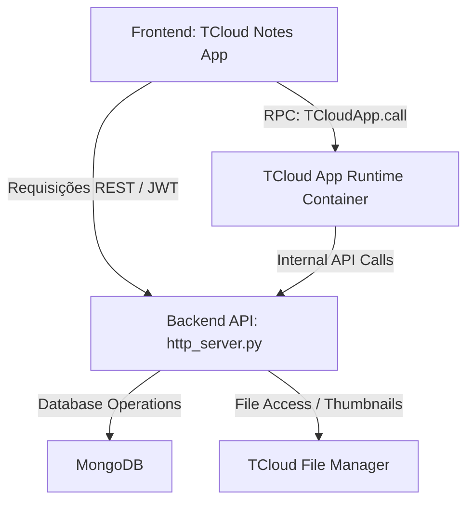

# Resumo Técnico: TCloud Notes

O **TCloud Notes** é uma aplicação de notas estruturada em blocos integrada ao ecossistema **TCloud** (uma plataforma de nuvem privada para gerenciamento de arquivos, streaming de mídia e utilitários). Ele foi projetado para oferecer uma experiência rica de escrita no estilo "Notion", combinando o editor de blocos Editor.js com recursos avançados de banco de dados MongoDB, propriedades personalizadas, backlinks automáticos e integração profunda com o sistema de arquivos TCloud.

---

## 1. Arquitetura Geral

A aplicação funciona sob uma arquitetura desacoplada baseada em rotas HTTP RESTful e eventos de runtime web:



- **Frontend (Standalone & Embedded):** Escrito em Vanilla HTML, CSS e JavaScript modular. Utiliza a biblioteca [Editor.js](https://editorjs.io/) vendorizada como editor de blocos.
- **Modo Híbrido de Execução:** 
  1. **Modo Runtime (Embedded):** Quando executado dentro do container web do TCloud, detecta o objeto `window.TCloudApp` e executa chamadas RPC assíncronas assinaladas no `manifest.json`.
  2. **Modo Standalone (Fallback):** Faz chamadas HTTP direta com tokens JWT (`Authorization: Bearer <tcloud_token>`).
- **Backend (Python / MongoDB):** Executado através do [notes_service.py](file:///Users/joaopauloferreiracastro/TCloud/notes_service.py) que implementa toda a lógica de negócios e persistência utilizando MongoDB, integrado com o servidor principal HTTP [http_server.py](file:///Users/joaopauloferreiracastro/TCloud/http_server.py).

---

## 2. Frontend: Estrutura e Editor de Blocos

A interface e a lógica do cliente estão organizadas em [apps/notes/](file:///Users/joaopauloferreiracastro/TCloud/apps/notes):

### Componentes Principais:
- **`index.html`:** Estrutura da barra lateral de notas (com filtros de busca, lixeira, favoritos e arquivo) e a área do editor principal contendo placeholders para capas e ícones customizados.
- **`script.js`:** Orquestrador principal da aplicação. Controla eventos de UI, roteamento baseado em hashes de URL (`#note=ID`), autosave com debounce, autocompletes de WikiLinks e renderização da barra lateral.
- **`editor-adapter.js`:** Inicializa e configura o Editor.js, gerenciando a conversão de dados do editor para o formato JSON estruturado aceito pelo backend.
- **`editor-tools.js`:** Define plugins customizados para o editor, incluindo as ferramentas de Checklist, Citação, Bloco de Código e Divisor visual.
- **`tcloud-blocks.js`:** Implementa blocos personalizados que se integram diretamente ao sistema de arquivos do TCloud (Arquivo, Imagem, Vídeo, Áudio, PDF, Pasta). Esses blocos buscam caminhos de arquivos e renderizam mídias ou links dinâmicos diretamente dentro da nota.

### Blocos de Conteúdo Suportados:
- `paragraph`: Texto corrido com suporte a tags inline (negrito, itálico, link, código inline).
- `header`: Títulos com níveis de cabeçalho configuráveis (h1, h2, h3).
- `list`: Listas ordenadas ou não ordenadas.
- `todo`: Lista de tarefas marcáveis (Checklist).
- `quote`: Citação destacada com suporte a autor/legenda.
- `codeBlock`: Código-fonte com formatação monoespaçada.
- `divider`: Linha horizontal de separação.
- **Blocos TCloud (`tcloudFile`, `tcloudImage`, `tcloudVideo`, `tcloudAudio`, `tcloudPdf`, `tcloudFolder`):** Blocos dinâmicos que contêm referências a caminhos de arquivos remotos da nuvem.

---

## 3. Backend: Persistência e Serviço de Notas

O backend é controlado pela classe `NotesService` em [notes_service.py](file:///Users/joaopauloferreiracastro/TCloud/notes_service.py), que interage com o MongoDB:

### Coleções do MongoDB Utilizadas:
1. **`notes_collection` (Notas):** Persiste os metadados e o conteúdo estruturado da nota.
2. **`note_revisions_collection` (Revisões):** Mantém o histórico completo de edições de cada nota, permitindo auditorias e restauração para versões passadas.
3. **`note_property_schema_collection` (Esquemas de Propriedade):** Armazena a definição de propriedades dinâmicas customizáveis adicionadas pelo usuário (estilo banco de dados Notion).
4. **`note_views_collection` (Visualizações/Views):** Salva filtros e ordenações personalizadas criados pelo usuário para visualizar conjuntos de notas.

### Modelo de Dados de uma Nota (`notes_collection`):
```json
{
  "_id": "UUID-da-Nota",
  "owner_id": "owner:default",
  "title": "Título da Nota",
  "content": {
    "time": 1716140000000,
    "blocks": [
      { "id": "b1a2c3", "type": "paragraph", "data": { "text": "Conteúdo..." } }
    ],
    "version": "2.31.6"
  },
  "excerpt": "Trecho curto em texto puro para visualização e busca...",
  "search_text": "Junção indexada do título, conteúdo e tags para busca full-text...",
  "version": 1,
  "favorite": false,
  "archived": false,
  "cover": { "type": "gradient", "value": "blue-green" },
  "icon": { "type": "symbol", "value": "▰" },
  "tags": ["trabalho", "ideias"],
  "properties": {
    "status": "Em andamento"
  },
  "outgoing_links": ["UUID-Nota-B"],
  "backlinks": ["UUID-Nota-C"],
  "attachments": [
    {
      "path": "/caminho/no/tcloud/foto.png",
      "name": "foto.png",
      "mime": "image/png",
      "size": 102400,
      "kind": "image"
    }
  ],
  "created_at": "ISODate",
  "updated_at": "ISODate",
  "deleted_at": null
}
```

---

## 4. Recursos Avançados

### A. Backlinks e WikiLinks (`[[Nota]]`)
O TCloud Notes implementa links bidirecionais automáticos:
- Ao escrever `[[Título de Outra Nota]]` no editor, o parser de markdown do backend identifica o padrão durante o salvamento.
- O backend localiza a nota de destino correspondente ao título e atualiza o array de referências.
- **`outgoing_links` (Links de Saída):** Salva na nota atual as notas que ela referencia.
- **`backlinks` (Links de Retorno):** O backend adiciona o ID da nota atual à lista de `backlinks` da nota destino. Isso permite que qualquer nota saiba exatamente quais outras notas a mencionam.

### B. Esquema de Propriedades Dinâmicas
Inspirado no Notion, o TCloud Notes permite criar campos estruturados para classificar as notas. Os tipos de propriedades suportados e validados no backend são:
- `text` e `url`: Texto puro limitado.
- `number`: Números inteiros ou decimais.
- `select` e `multi_select`: Seleção de opções predefinidas com cores configuráveis.
- `checkbox`: Valores booleanos (`true` ou `false`).
- `date`: Datas normalizadas no formato ISO.
- `relation`: Relação forte com outra nota existente, validando a integridade referencial no banco de dados.

### C. Sistema de Histórico e Revisões
- Cada salvamento significativo do editor gera uma nova entrada na coleção `note_revisions_collection`.
- A nota armazena um contador incremental `version`.
- É possível recuperar a lista de versões anteriores da nota através de `/api/notes/{note_id}/revisions` e restaurá-la completamente enviando uma requisição POST para `/api/notes/{note_id}/revisions/{version}/restore`.

### D. Exportação e Importação de Formatos
O Notes possui conversores embutidos para interagir com formatos externos:
- **Exportação:** Converte os blocos JSON do Editor.js para Markdown limpo (`.md`), documento HTML estilizado (`.html`) ou arquivo de estrutura nativa JSON (`.tcnote.json`).
- **Importação:** Lê arquivos de texto, Markdown ou JSON, realiza o parse dos títulos, cabeçalhos, checklists e divisores e reconstrói a estrutura interna de blocos compatível com o Editor.js.

---

## 5. Endpoints da API HTTP (`http_server.py`)

A tabela abaixo resume as principais rotas gerenciadas pelo servidor aiohttp para a aplicação de Notas:

| Método | Endpoint | Descrição |
|---|---|---|
| **GET** | `/api/notes` | Lista as notas ativas com filtros (`q` para busca, `tag`, `favorite`). |
| **POST** | `/api/notes` | Cria uma nova nota (suporta criação por templates). |
| **GET** | `/api/notes/{note_id}` | Obtém os dados detalhados e conteúdo de uma nota específica. |
| **PATCH** | `/api/notes/{note_id}` | Atualiza metadados parciais (título, favorito, capa, ícone, tags, etc.). |
| **PUT** | `/api/notes/{note_id}/content` | Atualiza o conteúdo em blocos do Editor.js da nota e atualiza backlinks/anexos. |
| **DELETE**| `/api/notes/{note_id}` | Envia uma nota para a lixeira (`deleted_at = agora`). |
| **POST** | `/api/notes/{note_id}/restore` | Restaura uma nota enviada para a lixeira. |
| **GET** | `/api/notes/{note_id}/backlinks` | Obtém todas as notas que possuem referências para a nota especificada. |
| **GET** | `/api/notes/{note_id}/revisions` | Obtém o histórico de versões salvas da nota. |
| **POST** | `/api/notes/{note_id}/revisions/{version}/restore` | Restaura a nota para uma versão histórica selecionada. |
| **GET** | `/api/notes/{note_id}/export` | Exporta a nota no formato solicitado (`markdown`, `html` ou `json`). |
| **POST** | `/api/notes/import` | Importa uma nota a partir de um arquivo `.md`, `.txt` ou `.json`. |
| **GET** | `/api/notes/properties/schema` | Obtém a lista global de esquemas de propriedades personalizadas. |
| **PUT** | `/api/notes/properties/schema` | Atualiza o esquema de propriedades personalizadas. |
| **POST** | `/api/notes/query` | Executa filtros complexos estruturados com operadores condicionais. |
